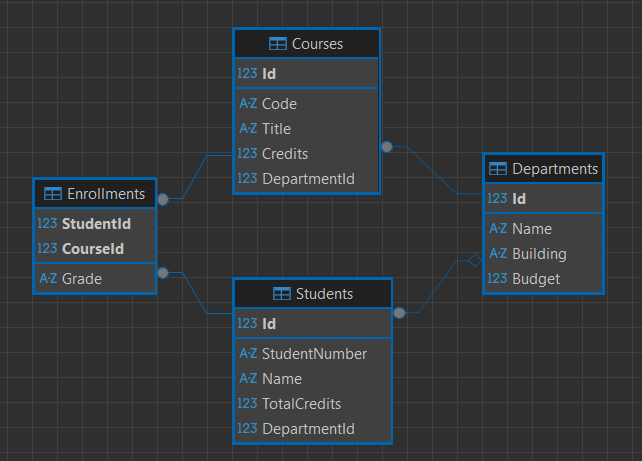
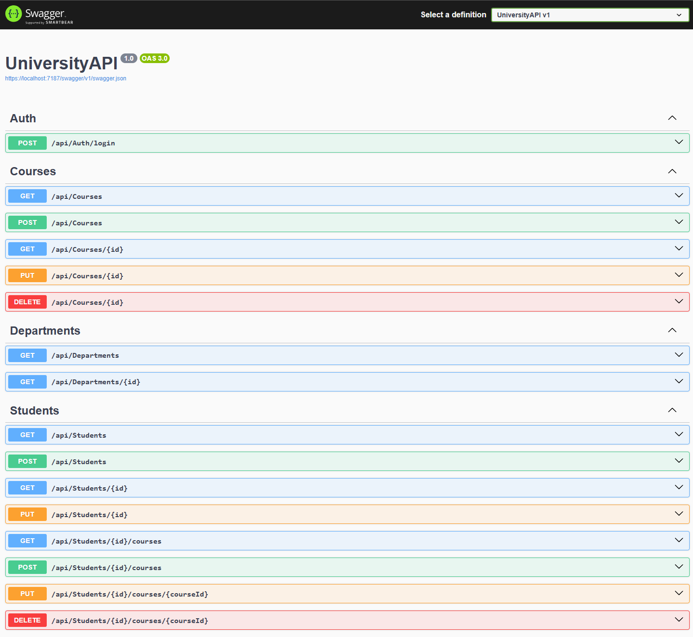

# UniversityAPI 

## 1. High‑level architecture
**Client (university-web)** - React + Vite single-page app, deployed separately.

**API (UniversityAPI)** - ASP.NET Core 8 Web API, deployed on runasp.net.

**Database** - SQLite file `university.db` with 4 tables.

```text
[Browser]
   | HTTP
[React client]
   | HTTP
[ASP.NET Core Web API]
   | EF Core
[SQLite database]
```


## 2. Database schema



**Tables and relationships:**

* `Departments(Id, Name, Building, Budget)`


* `Courses(Id, Code, Title, Credits, DepartmentId)`

  FK -> `Departments(Id)`.

* `Students(Id, StudentNumber, Name, TotalCredits, DepartmentId)`

  FK -> `Departments(Id)`.

* `Enrollments(StudentId, CourseId, Grade)`

  Composite PK `(StudentId, CourseId)`.

  FK -> `Students(Id)` and `Courses(Id)`.

* **one‑to‑many**: Department -> Courses, Department -> Students

* **many‑to‑many**: Student <-> Course via Enrollment

---

## 3. API surface



## 4. Authentication

**Test users**

| Email                                               | Password    | Role    | Linked student  |
| --------------------------------------------------- | ----------- | ------- | --------------- |
| [admin@dkit.ie](mailto:admin@dkit.ie)               | Admin123!   | Admin   | -               |
| [student00128@dkit.ie](mailto:student00128@dkit.ie) | Student123! | Student | `StudentId = 1` |
| [student12345@dkit.ie](mailto:student12345@dkit.ie) | Student123! | Student | `StudentId = 2` |

**JWT content:**

```json
{
  "sub": "student00128@dkit.ie",
  "role": "Student",
  "studentId": 1,
  "exp": 1710000000
}
```

Role and `studentId` are used by `[Authorize]` and helper methods so that:

* Admin can access everything.
* Student can only access their own `/api/students/{id}` and `/api/students/{id}/courses`.


## 5. Service / interface architecture

The goal is to move data access and business rules out of controllers.

```text
[Controller] -> [Service interface] -> [Service implementation] -> [EF Core DbContext]
```

Each controller depends on an interface.

For exampe:

```csharp
public class CoursesController : ControllerBase
{
    private readonly ICourseService _courses;

    public CoursesController(ICourseService courses)
    {
        _courses = courses;
    }
}
```


## 6. DTOs vs entities

**Entities are database level:**

`Student`, `Course`, `Department`, `Enrollment`

**DTOs are API level:**

* `DepartmentDto`
* `CourseSummaryDto`, `CourseDetailsDto`, `CourseCreateDto`, `CourseUpdateDto`
* `StudentSummaryDto`, `StudentDetailsDto`, `StudentCreateDto`, `StudentUpdateDto`
* `StudentEnrollmentDto`, `StudentEnrollmentCreateDto`, `StudentEnrollmentUpdateDto`
* `LoginRequestDto`, `LoginResponseDto`

 DTOs intentionally hide fields like `Department.Building` and `Department.Budget`


## 7. Deployment

API deployed on **runasp.net** via **WebDeploy**.

Example public endpoint: [https://university-api.runasp.net/api/departments](https://university-api.runasp.net/api/departments).

Client app `university-web` is deployed separately.


## 8. Testing

Project `UniversityAPI.Tests` (NUnit).

It uses **EF Core InMemory** with unique DB per test.


## 9. References

1. ASP.NET JWT Authentication Tutorial (YouTube)
[https://youtu.be/6DWJIyipxzw?si=EyyB_xTGV5neV43I](https://youtu.be/6DWJIyipxzw?si=EyyB_xTGV5neV43I)

2. Why `UseInMemoryDatabase` might not be available on `DbContextOptionsBuilder` (StackOverflow)
[https://stackoverflow.com/questions/48061096/why-cant-i-call-the-useinmemorydatabase-method-on-dbcontextoptionsbuilder](https://stackoverflow.com/questions/48061096/why-cant-i-call-the-useinmemorydatabase-method-on-dbcontextoptionsbuilder)

3. Tutorial: Create a controller-based web API with ASP.NET Core
[https://learn.microsoft.com/en-us/aspnet/core/tutorials/first-web-api?view=aspnetcore-8.0&tabs=visual-studio](https://learn.microsoft.com/en-us/aspnet/core/tutorials/first-web-api?view=aspnetcore-8.0&tabs=visual-studio)

4. Create a web API with ASP.NET Core controllers
[https://learn.microsoft.com/en-us/training/modules/build-web-api-aspnet-core/](https://learn.microsoft.com/en-us/training/modules/build-web-api-aspnet-core/)

5. SQLite EF Core Database Provider
[https://learn.microsoft.com/en-us/ef/core/providers/sqlite/?tabs=dotnet-core-cli](https://learn.microsoft.com/en-us/ef/core/providers/sqlite/?tabs=dotnet-core-cli)

6. `DbContextOptionsBuilder` Class
[https://learn.microsoft.com/en-us/dotnet/api/microsoft.entityframeworkcore.dbcontextoptionsbuilder?view=efcore-8.0](https://learn.microsoft.com/en-us/dotnet/api/microsoft.entityframeworkcore.dbcontextoptionsbuilder?view=efcore-8.0)

7. Entity Framework Core In Memory Testing
[https://www.scottbrady.io/entity-framework/entity-framework-core-in-memory-testing](https://www.scottbrady.io/entity-framework/entity-framework-core-in-memory-testing)

8. Unit testing with InMemory and NUnit
[https://medium.com/%40busk.soerensen/unit-testing-with-inmemory-and-nunit-a474906bcf51](https://medium.com/%40busk.soerensen/unit-testing-with-inmemory-and-nunit-a474906bcf51)

9. Configure JWT Bearer authentication in ASP.NET Core
[https://learn.microsoft.com/en-us/aspnet/core/security/authentication/configure-jwt-bearer-authentication?view=aspnetcore-8.0](https://learn.microsoft.com/en-us/aspnet/core/security/authentication/configure-jwt-bearer-authentication?view=aspnetcore-8.0)

10. Introduction to JSON Web Tokens
[https://www.jwt.io/introduction#what-is-json-web-token](https://www.jwt.io/introduction#what-is-json-web-token)

11. JWT authentication in .NET 8 – complete guide
[https://medium.com/%40solomongetachew112/jwt-authentication-in-net-8-a-complete-guide-for-secure-and-scalable-applications-6281e5e8667c](https://medium.com/%40solomongetachew112/jwt-authentication-in-net-8-a-complete-guide-for-secure-and-scalable-applications-6281e5e8667c)

12. CORS in .NET – what it is and how to enable it
[https://www.stackhawk.com/blog/net-cors-guide-what-it-is-and-how-to-enable-it/](https://www.stackhawk.com/blog/net-cors-guide-what-it-is-and-how-to-enable-it/)

13. Testing controller logic in ASP.NET Core
[https://learn.microsoft.com/en-us/aspnet/core/mvc/controllers/testing?view=aspnetcore-8.0](https://learn.microsoft.com/en-us/aspnet/core/mvc/controllers/testing?view=aspnetcore-8.0)

14. ASP.NET Core unit testing (YouTube)
[https://youtu.be/l2vfdW2mhv0?si=OokVHJ0pAYqPbZCn](https://youtu.be/l2vfdW2mhv0?si=OokVHJ0pAYqPbZCn)

15. Validating with a service layer
[https://learn.microsoft.com/en-us/aspnet/mvc/overview/older-versions-1/models-data/validating-with-a-service-layer-cs](https://learn.microsoft.com/en-us/aspnet/mvc/overview/older-versions-1/models-data/validating-with-a-service-layer-cs)

16. Dependency injection into controllers in ASP.NET Core
[https://learn.microsoft.com/en-us/aspnet/core/mvc/controllers/dependency-injection?view=aspnetcore-8.0](https://learn.microsoft.com/en-us/aspnet/core/mvc/controllers/dependency-injection?view=aspnetcore-8.0)

17. Why write business logic in a separate service layer instead of controllers
[https://stackoverflow.com/questions/51942114/why-we-need-to-write-business-logic-in-separate-service-layer-instead-of-writing](https://stackoverflow.com/questions/51942114/why-we-need-to-write-business-logic-in-separate-service-layer-instead-of-writing)

18. Understanding DI in .NET Core/MVC
[https://stackoverflow.com/questions/67849554/understanding-di-in-net-core-mvc](https://stackoverflow.com/questions/67849554/understanding-di-in-net-core-mvc)

19. ASP.NET Web API – Service between controller and repository
[https://stackoverflow.com/questions/75791514/asp-net-web-api-service-between-controller-and-repository](https://stackoverflow.com/questions/75791514/asp-net-web-api-service-between-controller-and-repository)

